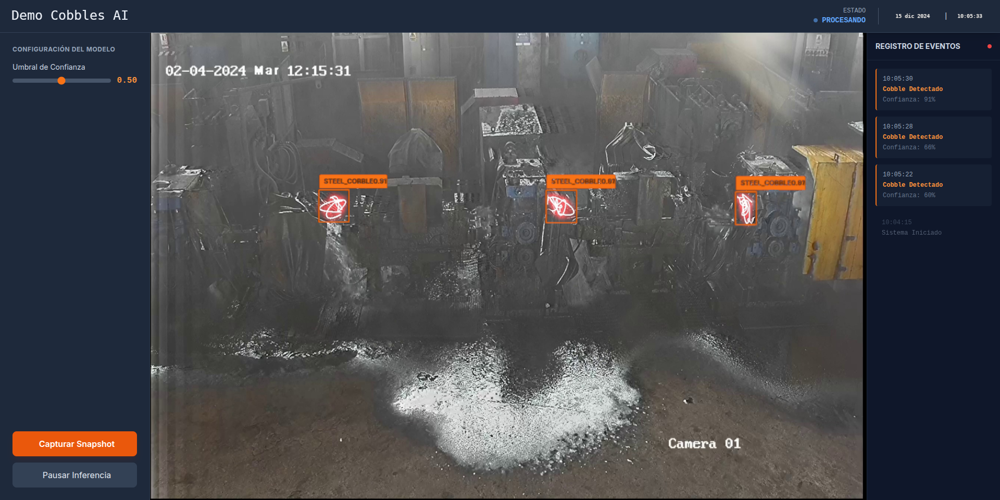

# Cobble Detection App

## Overview
La Aplicación de Detección de Cobble es un sistema de detección en tiempo real de atascos en barras de acero basado en visión por computadora e inteligencia artificial. La aplicación permite a los usuarios monitorear transmisiones de video, detectar cobbles (atascos en barras de acero), generar cobbles sintéticos para pruebas y ajustar parámetros de detección en tiempo real.



## Features
- Procesamiento de video en tiempo real y detección de cobbles
- Generación de cobbles sintéticos para pruebas
- Umbral de detección ajustable
- Captura y exportación de frames
- Interfaz gráfica amigable para el usuario
- Selección interactiva de puntos de cobbles
- Modelo de detección basado en YOLO

## Requirements

### System Requirements
- Python 3.x
- 4GB RAM (8GB recommended)
- Processor compatible with real-time video processing

### Dependencies
```
opencv-python
pillow
numpy
scipy
ultralytics
tkinter (usually comes with Python)
```

## Installation

1. Clone the repository:
```bash
git clone https://github.com/yourusername/cobble-detection.git
cd cobble-detection
```

2. Install required packages:
```bash
pip install -r requirements.txt
```

3. Download the YOLO model:
- Place the `best16.pt` file in the project root directory

## Usage

### Running the Application
```bash
python cobble_detection_app.py
```

### Basic Operations
1. Abre un archivo de video usando Archivo -> Abrir Video.
2. Haz clic en "Iniciar Generación" para habilitar la generación de cobbles sintéticos.
3. Haz clic en el video para colocar puntos de generación de cobbles.
4. Usa "Procesar Video" para iniciar la detección.
5. Ajusta el umbral usando el control deslizante.
6. Guarda frames usando Archivo -> Guardar Frame.

## Project Structure
```
cobble-detection/
├── cobble_detection_app.py     # Main application file
├── best16.pt                   # YOLO model file
├── requirements.txt            # Project dependencies
├── screenshots/                # Application screenshots
└── README.md                   # This file
```

## Key Functions

### Cobble Generation
```python
def generate_cobbles(image, centers, scale_factor=0.4):
    """
    Generates synthetic cobbles at specified points
    
    Args:
        image: Input frame
        centers: List of points where cobbles will be generated
        scale_factor: Size adjustment factor for generated cobbles
    
    Returns:
        Image with synthetic cobbles
    """
```

### Model Detection
```python
def annotate_with_model(model, frame, conf_threshold):
    """
    Processes frame through YOLO model for cobble detection
    
    Args:
        model: YOLO model instance
        frame: Input frame
        conf_threshold: Confidence threshold for detections
    
    Returns:
        Annotated frame with detections
    """
```

## License
This project is licensed under the MIT License - see the LICENSE file for details.

## Acknowledgments
- YOLO for object detection
- OpenCV for image processing
- The Ultralytics team for their YOLO implementation

## Contact
Eybert Macedo - emacedop@unsa.edu.pe
Project Link: https://github.com/EybertMacedo/cobbles

## Support
Para soporte y preguntas, crea un issue en el repositorio de GitHub o contacta al equipo de desarrollo.
