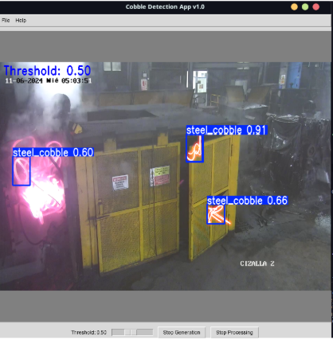

# Cobble Detection App

## Overview
Cobble Detection App is a real-time steel bar jam detection system based on computer vision and artificial intelligence. The application allows users to monitor video feeds, detect cobbles (steel bar jams), generate synthetic cobbles for testing, and adjust detection parameters in real-time.



## Features
- Real-time video processing and cobble detection
- Synthetic cobble generation for testing
- Adjustable detection threshold
- Frame capture and export capabilities
- User-friendly graphical interface
- Interactive cobble point selection
- YOLO-based detection model

## Requirements

### System Requirements
- Python 3.x
- 4GB RAM (8GB recommended)
- Processor compatible with real-time video processing

### Dependencies
```
opencv-python
pillow
numpy
scipy
ultralytics
tkinter (usually comes with Python)
```

## Installation

1. Clone the repository:
```bash
git clone https://github.com/yourusername/cobble-detection.git
cd cobble-detection
```

2. Install required packages:
```bash
pip install -r requirements.txt
```

3. Download the YOLO model:
- Place the `best16.pt` file in the project root directory

## Usage

### Running the Application
```bash
python cobble_detection_app.py
```

### Basic Operations
1. Open a video file using File -> Open Video
2. Click "Start Generation" to enable synthetic cobble generation
3. Click on the video to place cobble generation points
4. Use "Process Video" to start detection
5. Adjust the threshold using the slider
6. Save frames using File -> Save Frame

## Project Structure
```
cobble-detection/
├── cobble_detection_app.py     # Main application file
├── best16.pt                   # YOLO model file
├── requirements.txt            # Project dependencies
├── screenshots/                # Application screenshots
└── README.md                   # This file
```

## Key Functions

### Cobble Generation
```python
def generate_cobbles(image, centers, scale_factor=0.4):
    """
    Generates synthetic cobbles at specified points
    
    Args:
        image: Input frame
        centers: List of points where cobbles will be generated
        scale_factor: Size adjustment factor for generated cobbles
    
    Returns:
        Image with synthetic cobbles
    """
```

### Model Detection
```python
def annotate_with_model(model, frame, conf_threshold):
    """
    Processes frame through YOLO model for cobble detection
    
    Args:
        model: YOLO model instance
        frame: Input frame
        conf_threshold: Confidence threshold for detections
    
    Returns:
        Annotated frame with detections
    """
```

## Contributing
1. Fork the repository
2. Create your feature branch (`git checkout -b feature/AmazingFeature`)
3. Commit your changes (`git commit -m 'Add some AmazingFeature'`)
4. Push to the branch (`git push origin feature/AmazingFeature`)
5. Open a Pull Request

## License
This project is licensed under the MIT License - see the LICENSE file for details.

## Acknowledgments
- YOLO for object detection
- OpenCV for image processing
- The Ultralytics team for their YOLO implementation

## Contact
Your Name - your.email@example.com
Project Link: https://github.com/yourusername/cobble-detection

## Support
For support and questions, please create an issue in the GitHub repository or contact the development team.
